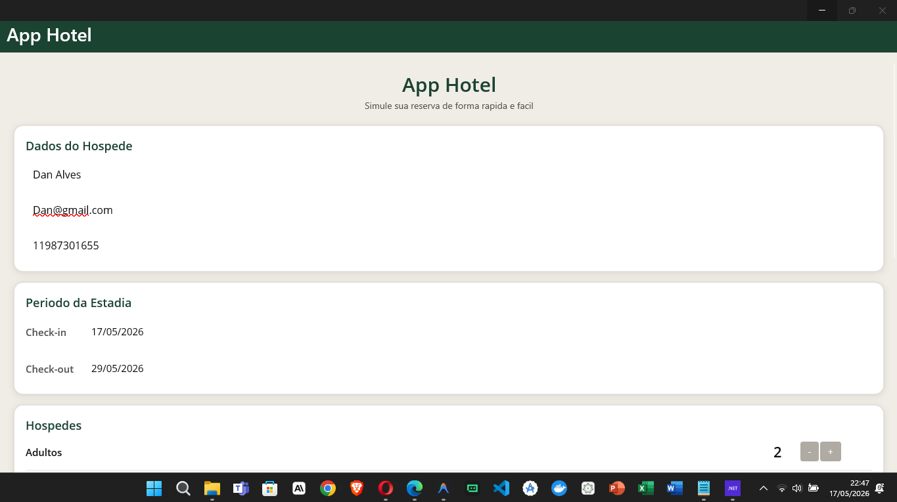
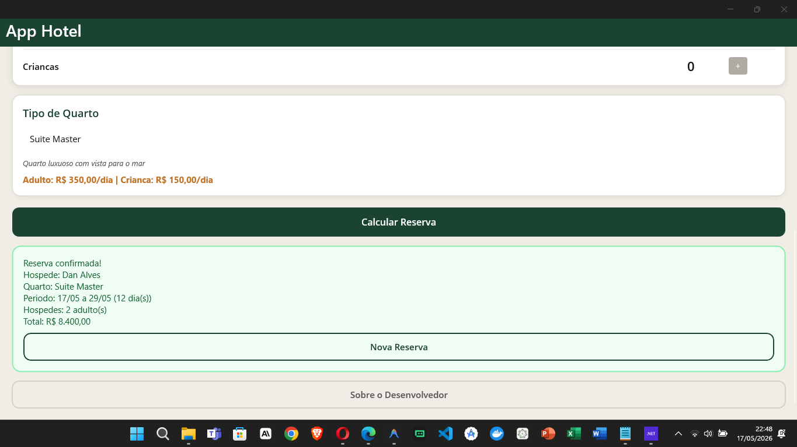
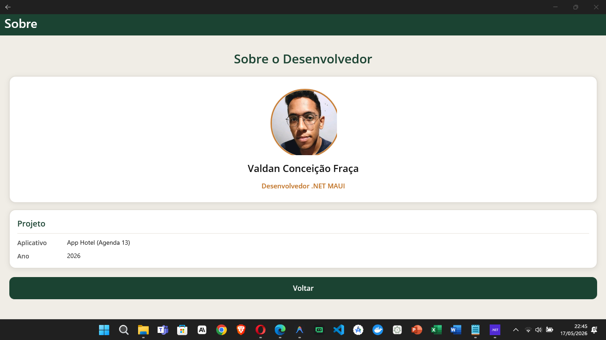

# 🏨 App Hotel - Projeto Agenda 13

Olá, Professora! 
Este repositório contém a entrega do meu projeto **App Hotel**, desenvolvido como requisito para a **Agenda 13 - Desenvolvimento Mobile**. 
O objetivo deste documento é apresentar a proposta da aplicação, as competências técnicas aplicadas e como o projeto atende rigorosamente a todos os critérios de avaliação exigidos.

---

## 🎯 Proposta da Aplicação e Critérios Atendidos

A aplicação simula um sistema de reservas de hotel construído em **.NET MAUI**, focado em separar a lógica de negócio da interface gráfica. Abaixo detalho como os requisitos da atividade foram cumpridos:

### 1. Desenvolvimento do Layout Base ✅
A interface principal foi estruturada utilizando corretamente os controles interativos exigidos:
- **`DatePicker`**: Utilizado para gerenciar e validar as datas de *Check-in* e *Check-out*.
- **`Picker`**: Implementado para a seleção dinâmica do tipo de quarto (ex: Suíte Master, Quarto Família).
- **`Stepper`**: Utilizado para incrementar/decrementar de forma segura a quantidade de hóspedes (Adultos e Crianças).

### 2. Aplicação do Conceito de BindingContext ✅
O projeto aplica o padrão focado em dados de forma inicial. Toda a regra de negócio (cálculos de diárias, validação de capacidade e datas) está isolada na classe `HotelLogica.cs`. A comunicação entre a interface (XAML) e o C# ocorre **obrigatoriamente via `BindingContext`**, garantindo que a `MainPage.xaml.cs` (Code-Behind) não possua lógica de cálculo, apenas eventos de interface.

### 3. Criação e Personalização da Tela 'Sobre' ✅
Foi desenvolvida a página `Sobre.xaml` (ContentPage) contendo:
- O componente `<Image>` carregando minha foto real (`minha_foto.png`).
- Meu nome de desenvolvedor e o ano de desenvolvimento explícitos usando `<Label>`.
- Layout 100% responsivo estruturado com `VerticalStackLayout` e alinhamentos corretos de Grid.

### 4. Navegação ✅
Na tela principal, adicionei o botão "Sobre o Desenvolvedor" que invoca de forma assíncrona o método `Navigation.PushAsync(new Sobre())`, garantindo uma navegação fluida entre as páginas.

### 5. Um Gostinho da Aplicação Funcionando! 🚀📸

Para facilitar a avaliação da professora e demonstrar a robustez do projeto, confira abaixo como a aplicação ficou na prática. A interface foi construída com foco na clareza, usabilidade e atende 100% às exigências técnicas.

#### 🏨 1. Tela Inicial - Preenchimento de Dados
Aqui iniciamos a simulação da reserva. A tela recebe os dados do hóspede e captura o período da estadia com uma validação limpa através dos componentes nativos **`DatePicker`**.


#### 🛏️ 2. Regra de Negócio em Ação - Seleção e Cálculo Final
Nesta etapa, demonstramos a utilização avançada dos controles **`Stepper`** para a contagem de hóspedes e o **`Picker`** para o tipo de acomodação. O grande destaque é o processamento transparente das informações via **`BindingContext`**: com um único clique em "Calcular Reserva", a classe `HotelLogica.cs` calcula as diárias e atualiza a interface instantaneamente!


#### 🧑‍💻 3. Tela Sobre o Desenvolvedor
Uma página elegante e responsiva que exibe as credenciais do desenvolvedor, demonstrando também o domínio do esquema de navegação entre páginas (usando o botão "Voltar").


---

## ⚙️ Como Rodar a Aplicação Passo a Passo

Para compilar e testar este projeto em sua máquina local:

1. **Pré-requisitos**: Certifique-se de ter o **Visual Studio 2022** instalado com a carga de trabalho *"Desenvolvimento de interface do usuário de aplicativo multiplataforma do .NET"* (.NET MAUI).
2. **Clone o Repositório**:
   Abra o terminal ou prompt de comando e execute:
   ```bash
   git clone https://github.com/valdandaconceicao-boop/AppHotel.git
   ```
3. **Abra o Projeto**: Dê um duplo clique no arquivo `AppHotel.sln` ou `AppHotel.csproj` para abri-lo no Visual Studio.
4. **Compile e Execute**: 
   - No painel superior do Visual Studio, selecione o destino da depuração como **"Windows Machine"** (Máquina Local do Windows) ou escolha um **Emulador Android**.
   - Clique no botão verde de *Play* (ou pressione **F5**).
   - O aplicativo será construído e a tela de simulação de reservas aparecerá pronta para uso.

---

## 🧠 Lógica de Negócio (Como Funciona)

Toda a inteligência do app está na classe `HotelLogica.cs` (que herda de `INotifyPropertyChanged`).
- Ao escolher as datas de *Check-in* e *Check-out*, a lógica valida automaticamente para impedir que o usuário selecione uma data de saída anterior à de entrada.
- Os *Steppers* controlam a quantidade mínima de adultos (1) e limite máximo de crianças.
- Cada quarto possui regras financeiras e de capacidade (ex: O *Quarto Individual* tem diária de criança fixada, e a lógica bloqueia o cálculo caso crianças sejam selecionadas nesse tipo específico de quarto).
- O botão "Calcular" invoca a função que processa os dias de estadia × quantidade de pessoas × valores do quarto escolhido, retornando os dados finais processados de volta para a visualização gráfica.

---

## 💪 Pontos Fortes do Projeto

- **Arquitetura Limpa**: O uso de `BindingContext` foi implementado rigorosamente, mantendo as responsabilidades muito bem divididas e o *Code-Behind* limpo.
- **Robustez de Layout (Design Preto e Branco)**: O XAML foi otimizado para um padrão mais limpo e corporativo, garantindo compatibilidade impecável no Windows Desktop e Mobile, impedindo sobreposição e esmagamento dos controles `Steppers` e `DatePickers`.
- **Validações Pró-ativas**: O código previne erros antes do cálculo, não permitindo processamento em casos de quartos vazios ou datas não lógicas.

## 🚧 Pontos em Desenvolvimento (Para Melhorar)

Pensando na evolução do software para as próximas etapas, os seguintes pontos já estão mapeados para melhoria contínua:
- **Banco de Dados Real**: Os quartos atualmente estão injetados no código (mockados no construtor). O próximo passo evolutivo é integrar o SQLite para persistência local ou consumir uma API Restful.
- **Sistema de Feedback Visual**: Melhorar os retornos informativos usando Pop-ups (`DisplayAlert`) ao invés de apenas textos em tela, melhorando substancialmente a Experiência do Usuário (UX).
- **Implementação Avançada do MVVM**: Embora a ligação de dados (`BindingContext`) atenda 100% da Agenda 13, pretendo introduzir o uso de `Commands` em versões futuras para eliminar completamente a dependência de eventos `Click` no *Code-Behind*.

---
*Projeto desenvolvido por Valdan Conceição Fraça.*
